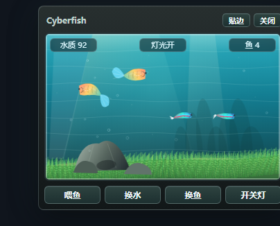
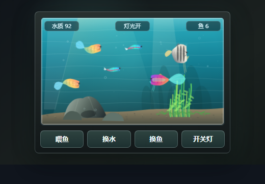
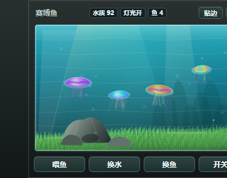
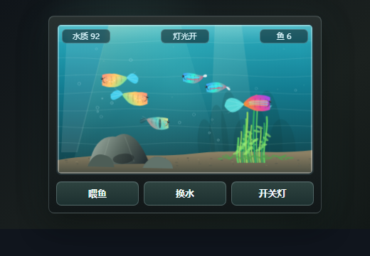

# Cyberfish / 赛博鱼

> cyberpunk keep cyberfish

一个火柴盒大小的桌面生态鱼缸。所有鱼类和水母均使用 Canvas 程序化绘制与骨架动画，不使用鱼类贴图或精灵。









## 特性

- 35 种常见观赏鱼和 10 种水母。
- 每次生成 4 个生物、2 个品种，繁殖数量不设上限。
- 鱼体采用柔性脊柱、头身尾延迟转向与 2.5D 体积投影。
- 包含群游、抢食、追逐、避让、求偶、繁殖等互动。
- 水草铺满底床并持续摆动，随机开放 30 种小花。
- 支持喂鱼、换水、换鱼、开关灯。
- Electron 桌面窗口支持一键贴边和恢复。
- 自动保存鱼群、水质、灯光、食物和花朵状态。
- 针对 Canvas 绘制、鱼群邻域计算和后台运行做了性能优化。

## 玩法

- 浏览器体验：直接打开 `index.html`，或运行 `node server.js` 后访问 `http://127.0.0.1:8088/`。
- 桌面程序：安装依赖后运行 `npm start`。
- Windows 打包：运行 `npm run build:win`。
- 操作有 `喂鱼`、`换水`、`换鱼`、`开关灯`。
- 桌面程序顶部提供贴边、恢复和关闭操作。
- `换鱼` 会从 45 种候选生物中抽取 2 个品种，每个品种 2 条，共 4 条；其中包含 35 种观赏鱼和 10 种水母。
- 初始和换鱼固定为 4 条鱼；繁殖不设数量上限。
- 鱼体使用程序化骨架动画：每一帧根据脊柱点重算轮廓、鳍和尾柄，不使用贴图或精灵。
- 稳定游动采用身体-尾鳍推进，尾端振幅最大；鱼始终保持侧身，不做上下翻身。
- 掉头使用 2.5D 体积投影：头部先转，身体跟随，尾部滞后；渲染时绘制远侧/近侧轮廓、厚度、鳍遮挡和眼睛位置，不再使用 `scaleX` 纸片翻转。
- 鱼缸造景参考 Nature Aquarium / Iwagumi：不对称石组、右侧水草群、坡度底砂、中部留白和柔和水下光束。

## 候选种类

孔雀鱼、霓虹灯鱼、宝莲灯鱼、斗鱼、神仙鱼、七彩神仙鱼、斑马鱼、白云金丝鱼、三角灯鱼、红鼻剪刀、黑裙鱼、虎皮鱼、樱桃灯、红剑尾、月光鱼、玛丽鱼、珍珠马甲、丽丽鱼、拉米雷兹短鲷、鼠鱼、库利泥鳅、小精灵鱼、黄金大胡子、金鱼、锦鲤、帝王灯、刚果灯、玻璃猫、电光美人、蓝眼灯、蓝曼龙、接吻鱼、彩虹鲨、暹罗飞狐、金苔鼠。

水母：紫条纹水母、太平洋海刺水母、日本海刺水母、蛋黄水母、花笠水母、黑海刺水母、皇冠水母、蓝彩脂水母、钟水母、金点泻湖水母。

## 动作模型

- 群游型：小型灯鱼、三角灯等会靠近同类，并保持中上层巡游。
- 突进滑行型：斑马鱼、虎皮鱼采用短促加速和滑行间隔。
- 悬停长鳍型：斗鱼、马甲鱼、丽丽鱼主要靠胸鳍小幅摆动，身体波幅较低。
- 盘形慢游型：神仙鱼、七彩神仙鱼体高更大，转向更慢，胸鳍参与感更强。
- 底栖型：鼠鱼、库利泥鳅、小精灵、大胡子贴近底床或石组，垂直运动更少。
- 鱼会根据品种做不同动作：孔雀鱼大尾摆动巡游、霓虹灯鱼小群游动、斗鱼慢速悬停和舒展鱼鳍、短鲷偏爱靠近水草觅食。
- 水质、进食和光照状态合适时，同品种成鱼会求偶并繁殖幼鱼。
- 水母使用独立的伞体脉冲和触手漂移模型，不套用鱼体骨架。

## 文件

- `index.html`：页面结构
- `style.css`：火柴盒尺寸的鱼缸界面
- `game.js`：Canvas 动画、鱼群行为、互动和繁殖逻辑
- `main.js` / `preload.js`：Electron 窗口、贴边和持久化接口
- `server.js`：本地静态预览服务
- `scripts/create-icon.js`：应用图标生成脚本

## 开发

```bash
npm install
npm start
```

项目使用 Apache License 2.0。
